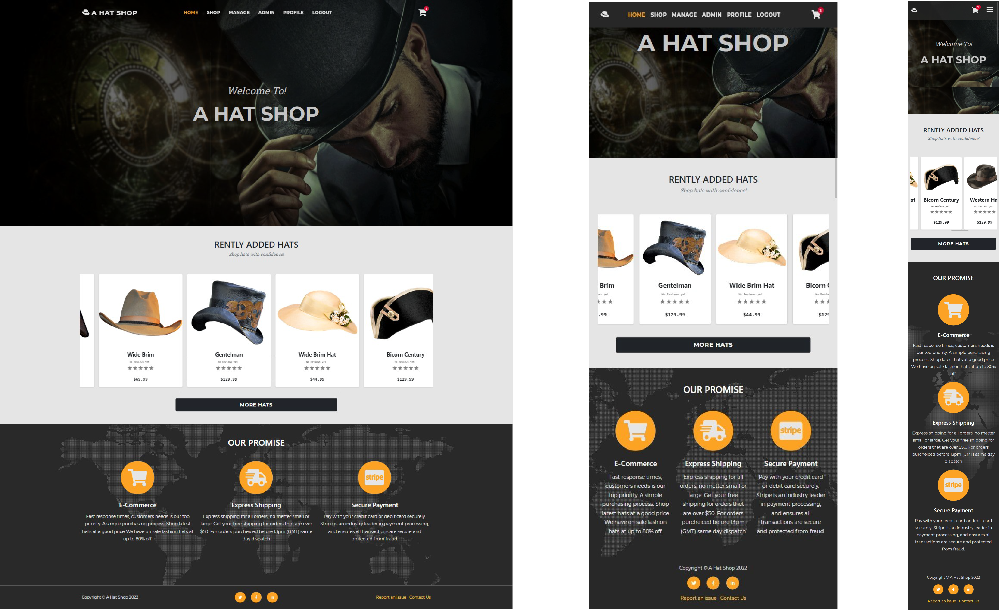
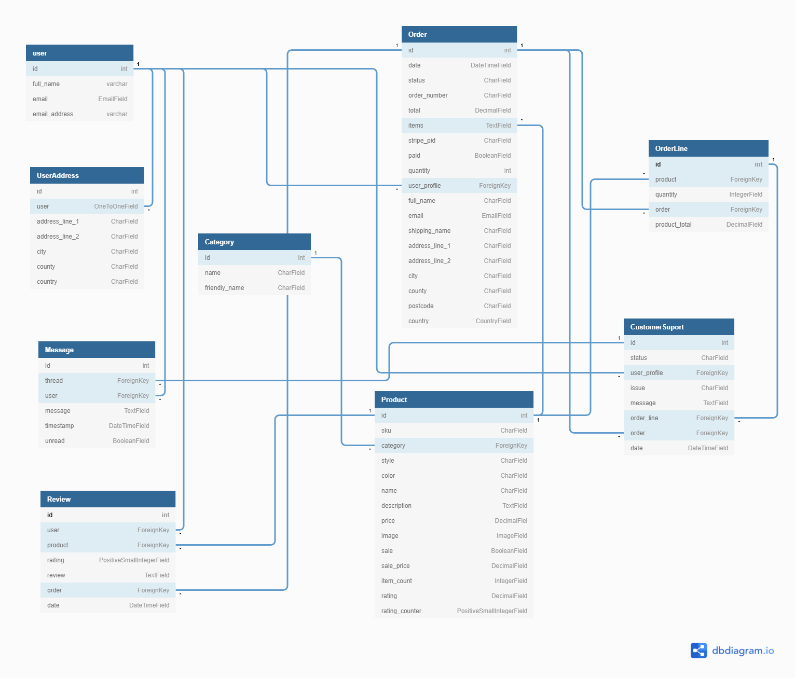
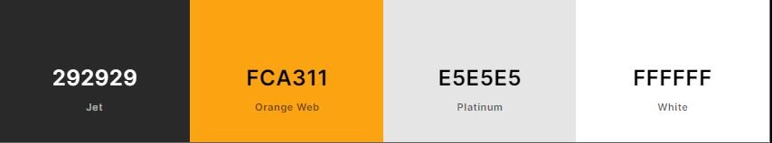

 top

# *A Hat Shop*
## [View the live project here.](https://a-hat-shop.herokuapp.com/)

### Table of contents

1. [Introduction](#top)
1. [Ux](#UX)
    - [User Stories](#User-Stories)
    - [Strategy](#Strategy)
    - [Scope](#Scope)
    - [Structure](#Structure)
    - [Skeleton](#Skeleton)
    - [Surfaice](#Surfaice)
1. [Features](#Features)
1. [Features to implement](#Features-to-implement)
1. [Testing](#project_files/TESTING.md)
   - [TESTING.md](project_files/TESTING.md)
   - [Bugs TESTING.md](project_files/TESTING.md#Bugs)
   - [W3C-Validation TESTING.md](project_files/TESTING.md#Validation)   
1. [Technologies and Frameworks](#Technologies-and-Frameworks)
1. [Deployment](#Deployment)
   - [Fork A repository](#Fork-A-repository)
   - [Creating a Clone Deploy Locally](#Creating-a-Clone-Deploy-Locally)
   - [Deploying on Heroku Pages](#Deploying-on-Heroku-Pages)
1. [Credits](#Credits)

# [&#8686;](#top)

# ***Introduction***

## **Full Stack Frameworks with Django Milestone Project.**

This is my Fourth and last of Milestone Projects that the developer must complete during Full Stack Web Development Program at The Code Institute.

This project, is a full-stack site based around business logic. With an authentication and payment service mechanisms to purchase of a product/service.

It's all about the hat
## **Main Technologies**
HTML, CSS, JavaScript, Python+Django

Relational database (recommending MySQL or Postgres)

Stripe payments

Additional libraries and APIs

## **Mandatory Requirements**
source: [code institute](https://codeinstitute.net/)
1. Django Full Stack Project: Build a Django project backend by a relational database to create a website that allows users to store and manipulate data records about a particular domain.
1. Multiple Apps: The project must be a brand new Django project, composed of multiple apps (an app for each potentially reusable component in your project).
1. Data Modeling: Relational database schema well-suited for your domain. And relationships between entities. Create at least 2 custom django models.
1. User Authentication: The project should include an authentication mechanism, allowing a user to register and log in, and there should be a good reason as to why the users would need to do so.
1. User Interaction: Include at least one form with validation that will allow users to create and edit models in the backend (in addition to the authentication mechanism).
1. Use of Stripe: At least one of your Django apps should contain some e-commerce functionality using Stripe. This may be a shopping cart checkout or single payments, or donations, etc.
1. Structure and Navigation: Incorporate a main navigation menu and structured layout.
1. Use of JavaScript: The frontend should contain some JavaScript logic you have written to enhance the user experience.
1. Documentation: Write a README.md file for your project that explains what the project does and the value that it provides to its users.
1. Version Control: Use Git & GitHub for version control.
1. Attribution: Attribute any code from external sources to its source via comments above the code and (for larger dependencies) in the README.
1. Deployment: Deploy the final version of your code to a hosting platform Heroku.
1. Security: Not include any passwords or secret keys in the project repository, turn off the Django DEBUG mode, which could expose secrets.

# [&#8686;](#top)
# ***UX*** 
## **User Stories**

### **As A Unregistered user**
1. First time visitor is able to understand purpose of the website.
1. User is able to easly navigate the website.
1. User is able to find products by description and product name.
1. Good product description and Product photography.
1. To be able make easy and secure payments as a guest user.
1. To be able to contact the company for any query or issue.

### **As A Registered user**
1. All of the above and..
1. Saving shipping information for fast checkout.
1. Access to complete overview of existing orders.
1. Self-manage of account details and shipping adresses for fast checkout.
1. Access to order history and other documents.

### **As an Administrator**
1. As an Administrator, I want to monitor shop items with ease.
1. As an Administrator, I want to add/edit and delete items.
1. As an Administrator, I want to be able to track all the purchases.
1. As an Administrator, I want track and manage all the shipping information.
1. As an Administrator, I want to be able to manage User access and accounts.

### **Site Owner goals**
1. Get the business online and expand online presence. 
1. Drive new customers to the website Provide guest checkout option.
1. Provide users with ability to create account, save shopping-cart and user deteails for fast checkout.
1. Maximize sales, Offer range of Special Offers and deals.
1. Offer customers a fast and secure payment option.
1. Customer Support Improve customer satisfaction through better service

## **Strategy**
# [&#8686;](#top)
### **The website needs to enable the User to**
1. Easy navigate and find the products that they are interested in buying.
1. Easily select the product that user wishes to purchase.
1. Register account to have personal account.
1. Login and Save shipping details for fast checkout.
1. Update account details/shipping details or delete their account.
1. Enable the User to track their order history.
1. To be able to make instant and safe payments.
1. Have The ability to contact company if they have a query.

### **The website needs to enable the Administrator to**
1. Enable administrator to monitor shop items with ease.
1. Enable administrator to add/edit and delete shopping items in template or admin interface.
1. Enable the Administrator to track all the purchases.
1. Enable the Administrator to track shipping information.
1. Update user account details or delete their accounts.

### **The website needs to enable the company to**
1. Get the business online and expand online presence. 
1. Showcase brand, website needs to have great product images with clear description.
1. And Provide users ability to create account and save shopping-cart and user deteails.
1. Provide method for customers with a quick, simple and safe way to pay.
1. Provide offers, special deals, and increase potentialy new and existing customer         retention and loyalty.
1. Provide the customers with contact information and support.

# [&#8686;](#top)
## **Scope**
Features to implement in terms of viability/feasibility.\
Below is a Dot Plot chart consisting of data points plotted on a scale of 1 represents least and 5 the most.\
Line plots screenshot [image](project_files/images/wireframes/plot.jpg)

#### Functionality Requirements
- Website Navigation with internal site links.
    - Internal links is Linked with Django placeholders in the template. 
    - Responsive bootstrap website navigation menu.
- Products gallery with descriptions.
    - On click to reveal individual item detailed view.
    - Add to basket functionality
- Checkout and shopping Cart.
    - Implement Stripe payment processing platform APIs to accept manage payments.
    - Implement the calculation logic that adds the shipping charge to the shopping cart totals.
- Product Search function and sort
    - Ability To search products by keyword.
    - Ability to categorise products by categories.
- User Registration/Log-In.
   - Use of Allouth Django applications authentication, registration, account management.
- User Profile.
   - Edit, Delete User Acount Details,
   - Wiew Shopping history Details.
   - Ability to add, Edit remove shopping Cart Content.
- Django admin interface.
   - To perform create, read, update and delete operations on the user accounts and shop items.
- Ability for admin user adding/Editing or deleting shop items.
   - Admin user Extended functionality to edit remove or add new items in the temlate.
- Integrate PostgreSQL Database.
   - Content description and image links stored and managed PostgreSQL database
- Static file storage on AWS S3
   - Use of cloud Storage Amazon S3 for all the media and static file storage.
- Customer Support contact form.
   - Ability for customer to contact support.
.
#### Content Requirements
- Landing Page
    - Navigation at the top
        - Dropdown 
            - Login/Register link
            - logout if logged in
            - Manage account details
            - If admin link to add new product.
        - Shopping cart
        - Search field
        - Categories link buttons
    - Product gallery scroll down
- Sign In
    - Email field to enter email address
    - Enter password
    - Click "Sign In" button
- Create account
    - In the "Username" field, enter a username
    - Enter Email address
    - Enter and confirm your password
    - Click "Create new account" button
- Shopping cart
    - Allows shopping customers to add a list of items for purchase.
    - The customer can easily add and remove items from their shopping cart.
    - Save user details for fast checkout.
- Checkout 
    - Stripe checkout for credit cards 
    - Unregistered user will have to fill in shopping details each time shopper visits the shop.
    - Populate Saved registered user shipping details with data either saved.
- User Account
    - View purchase history
        - Individual Card with image, title, and description.
    - Edit profile details and shipping address
        - Edit/ Change Email/Password And shipping details.
    - Delete profile

- For Admin user all the products feature buttons with access to edit and delete        functionality.
- Admin Add/update product forms
    - Product Name
    - Product Category
    - Product Price
    - Image upload field
    - Text area field for item description
    - Post item button.
- Contact Form
    - Name input field
    - Email Address input field
    - Text area input field
    - Submit button
- footer
    - Copyright information
    - link to contact form
    - Social Links
        - FaceBook, LinkedIn, Instagram

# [&#8686;](#top)

## **Structure**

Site structure [image](project_files/images/structure/structure.png)\
Site structure Has changed slightly while progressing into the project.

Old Relational database Django models diagram [image](project_files/images/structure/structure-db.png)\
DB structure has slight changes made while progressing with this project.\

New updated relational database django models diagram [image](project_files/images/structure/db-models.png)



## **Skeleton**
### **Wireframes**

1. [landing page wireframe](project_files/images/wireframes/home-wf.png)
1. [Shopping Categories](project_files/images/wireframes/categories.png)
1. [Item Detailed view](project_files/images/wireframes/detailed.png)
1. [Admin Shopping Categories](project_files/images/wireframes/admin-categories.png)
1. [Admin Add New Item](project_files/images/wireframes/add.png)
1. [Admin Edit Item](project_files/images/wireframes/edit.png)
1. [Edit Account Details](project_files/images/wireframes/account-details.png)
1. [My Account](project_files/images/wireframes/account.png)
1. [Shopping Cart](project_files/images/wireframes/cart.png)
1. [Checkout](project_files/images/wireframes/checkout.png)

# [&#8686;](#top)
## **Surfaice**

### **Colour Scheme**


### **Fonts**
-  For comments bootstrap classes "text-muted text-italic"
- For small text or numbers bootstrap fort class "font-monospace"
- For forms and buttons google [Montserrat](https://fonts.google.com/specimen/Montserrat) with font-weight: 700;
- For paragraph Text content google [Roboto+Slab](https://fonts.google.com/specimen/Roboto+Slab)


### **Media**

Most copyright free images sourced from [pixabay ](https://pixabay.com)\
Thanks To:

Photo by <a href="https://unsplash.com/@seteph?utm_source=unsplash&utm_medium=referral&utm_content=creditCopyText">Allef Vinicius</a> on <a href="https://unsplash.com/s/photos/vintage-hat?utm_source=unsplash&utm_medium=referral&utm_content=creditCopyText">Unsplash</a>

Photo by <a href="https://unsplash.com/@raghav_113?utm_source=unsplash&utm_medium=referral&utm_content=creditCopyText">Raghav bhadoriya</a> on <a href="https://unsplash.com/s/photos/man-hat?utm_source=unsplash&utm_medium=referral&utm_content=creditCopyText">Unsplash</a>


- hats Image by [Koczot](https://pixabay.com/users/koczot-8279644/?utm_source=link-attribution&amp;utm_medium=referral&amp;utm_campaign=image&amp;utm_content=3387253) from [Pixabay](https://pixabay.com/?utm_source=link-attribution&amp;utm_medium=referral&amp;utm_campaign=image&amp;utm_content=3387253)

- Most hats Images by [Alexander Lesnitsky](https://pixabay.com/users/alles-2597842/?utm_source=link-attribution&amp;utm_medium=referral&amp;utm_campaign=image&amp;utm_content=4632733) from [Pixabay](https://pixabay.com/?utm_source=link-attribution&amp;utm_medium=referral&amp;utm_campaign=image&amp;utm_content=4632733)


- hats Image by [Heather Kemp](https://pixabay.com/users/heatherdawnkemp-4440879/?utm_source=link-attribution&amp;utm_medium=referral&amp;utm_campaign=image&amp;utm_content=3334230) from [Pixabay](https://pixabay.com/?utm_source=link-attribution&amp;utm_medium=referral&amp;utm_campaign=image&amp;utm_content=3334230)


- hats Image by [Press 👍👍 Thanks! 💖](https://pixabay.com/users/victoria_borodinova-6314823/?utm_source=link-attribution&amp;utm_medium=referral&amp;utm_campaign=image&amp;utm_content=5780902) from [Pixabay](https://pixabay.com/?utm_source=link-attribution&amp;utm_medium=referral&amp;utm_campaign=image&amp;utm_content=5780902)

 - hats Photo by [Dmytro Tolokonov](https://unsplash.com/@dtolokonov?utm_source=unsplash&utm_medium=referral&utm_content=creditCopyText) on [Unsplash](https://unsplash.com/s/photos/vintage-hat?utm_source=unsplash&utm_medium=referral&utm_content=creditCopyText)

 
- main Image by [S Greendragon](https://pixabay.com/users/greendragon-gecko-6553018/?utm_source=link-attribution&amp;utm_medium=referral&amp;utm_campaign=image&amp;utm_content=2819946) from [Pixabay](https://pixabay.com/?utm_source=link-attribution&amp;utm_medium=referral&amp;utm_campaign=image&amp;utm_content=2819946)

- Hats Image by [Gerhard G](https://pixabay.com/users/blende12-201217/?utm_source=link-attribution&amp;utm_medium=referral&amp;utm_campaign=image&amp;utm_content=2268994) from [Pixabay](https://pixabay.com/?utm_source=link-attribution&amp;utm_medium=referral&amp;utm_campaign=image&amp;utm_content=2268994)

- Hats Image by [Júnior Castro Júnior](ttps://pixabay.com/users/juniorxy-14617424/?utm_source=link-attribution&amp;utm_medium=referral&amp;utm_campaign=image&amp;utm_content=4694291) from [Pixabay](https://pixabay.com/?utm_source=link-attribution&amp;utm_medium=referral&amp;utm_campaign=image&amp;utm_content=4694291)

- Hats Image by [MirelaSchenk](https://pixabay.com/users/mirelaschenk-2784640/?utm_source=link-attribution&amp;utm_medium=referral&amp;utm_campaign=image&amp;utm_content=1469121) from [Pixabay](https://pixabay.com/?utm_source=link-attribution&amp;utm_medium=referral&amp;utm_campaign=image&amp;utm_content=1469121)

- Hats Image by [Angle-weixin ](https://pixabay.com/users/angle-weixin-2129673/?utm_source=link-attribution&amp;utm_medium=referral&amp;utm_campaign=image&amp;utm_content=1226644)from [Pixabay](https://pixabay.com/?utm_source=link-attribution&amp;utm_medium=referral&amp;utm_campaign=image&amp;utm_content=1226644)
  

- Hats Image by [Jean photosstock](https://pixabay.com/users/jean52photosstock-14428522/?utm_source=link-attribution&amp;utm_medium=referral&amp;utm_campaign=image&amp;utm_content=5996646) from [Pixabay](https://pixabay.com/?utm_source=link-attribution&amp;utm_medium=referral&amp;utm_campaign=image&amp;utm_content=5996646)

- Hats Image by [Sergei Tokmakov Terms Law](https://pixabay.com/users/sergeitokmakov-3426571/?utm_source=link-attribution&amp;utm_medium=referral&amp;utm_campaign=image&amp;utm_content=4883895) from [Pixabay](https://pixabay.com/?utm_source=link-attribution&amp;utm_medium=referral&amp;utm_campaign=image&amp;utm_content=4883895)

### *Templates*
- Landing Page Startup template [startbootstrap.com](https://startbootstrap.com/theme/agency)
- Shop page startup template [startbootstrap.com](https://startbootstrap.com/template/shop-homepage)
- Shop product item detailed template [startbootstrap.com](https://startbootstrap.com/template/shop-item)

# [&#8686;](#-)
# ***Features***
## **Home App** 
Index page screenshot [image](project_files/images/surfaice/home.png)
- Hero section images with added Parallax effects on scroll.
- Recently added hats horisontal scroll feature limited to letest 10 items.

## **Navigation** 
Mobile version nav screenshot [image](project_files/images/surfaice/m-nav.png)\
Desktop version nav screenshot [image](project_files/images/surfaice/pc-nav.png)
- Link active change color if active links on each page.
- Shop page has it's own navigation. Includes search and sorting functionatity.
- Shop page navigation shrinks while scrolling down and extends while scroll upwards and at top position nav is fully extended.
- Shop page include go up link for user to get to the top of the page with one click

## **Shop App**
Shop page screenshot [image](project_files/images/surfaice/shop.png)
- Search functionality enables users to search by name and description keywords.
- Sort products by Category, Style, Price (high to low)/(low to high), by name (a to z)/(z to a)and by rating (high to low)/(low to high).

**Product Model**
| Field Name | Field type | options |
| ----- | ----- | ----- |
|sku |CharField|max_length=60|
|category |ForeignKey|'Category', null=True, blank=True, on_delete=models.SET_NULL|
|style |CharField|max_length=60|
|color |CharField|max_length=60|
|name |CharField|max_length=60|
|description |TextField|max_length=250|
|price |DecimalField| max_digits=6, decimal_places=2|
|image |ImageField|null=True, blank=True|
|sale |BooleanField|default=False|
|sale_price |DecimalField|max_digits=6, decimal_places=2, null=True, blank=True|
|item_count |IntegerField|blank=False, null=False, default=0|
|rating |DecimalField|max_digits=6, decimal_places=2, null=True, blank=True|
|rating_counter |PositiveSmallIntegerField|default=0|

**Categories Model**
| Field Name | Field type | options |
| ----- | ----- | ----- |
|name |CharField|max_length=60|
|friendly_name |CharField|max_length=60, null=True, blank=True|

Individual Product page screenshot [image](project_files/images/surfaice/product.png)
- Individual product page where user can add item to the cart.
- Links for user to access review page for the current product.
- User with superuser privileges has access to link to the update product page.

## **Cart App** 
Cart screenshot [image](project_files/images/surfaice/cart.png)
- Add items to the cart session Item id, item count, item price.
- In cart context perform various calculations such as item times count, 
- item count times price, shipping price, discount prie total, and finaly grand total.
- Sunchronize inventory actual product quantity with cart session product quantity. Check each time the cart is accessed for inventory update then adjust acordingly. The products actual stock quantity is not changed in cart but only after successfull payment.

## **Checkout App** 

The website is connected to stripe test account.\
Use test payment details bellow.

| PAYMENT METHOD | SCENARIO | HOW TO TEST |
| ----- | ----- | ----- |
| Credit card|The card payment succeeds and doesn’t require authentication | Credit card number 4242 4242 4242 4242 with any expiry, CVC, and postal code. |
| Credit card  | The card payment requires authentication. | Credit card number 4000 0025 0000 3155 with any expiry, CVC, and postal code. |
| Credit card | The card is declined with a decline code such as insufficient_funds. | Credit card number 4000 0000 0000 9995 with any expiry, CVC, and postal code. |

Checkout page screenshot [image](project_files/images/surfaice/checkout.png)
- Stripe checkout payment proccesor pay with credit card or debit card securely.
- For registered user form will populate with user details if shipping details was saved in profile details page.
- Automated inventory updating. Automatically updates inventory whenever there is a stripe payment success or payment failure webhook received.
- Order backup for failed orders if Stripe successfull payment Webhook receeived will create an order.

**Order Model**
| Field Name | Field type | options |
| ----- | ----- | ----- |
|date |DateTimeField|auto_now_add=True|
|status |CharField| max_length=50, default=SUBMITTED, choices=ORDER_STATUS|
|order_number |CharField| max_length=32, null=False, editable=False|
|total |DecimalField| max_digits=10, decimal_places=2, default=0)
|delivery |DecimalField| max_digits=6, decimal_places=2, default=0|
|items |TextField |null=False, blank=False, default=''|
|stripe_pid |CharField| max_length=254, null=False, blank=False, default=''|
|paid |BooleanField|default=False)
|user_profile |ForeignKey| User, on_delete=models.SET_NULL, null=True, blank=True, related_name='orders'|
|full_name |CharField|max_length=50|
|email |EmailField|max_length=50|
|shipping_name |CharField|max_length=50|
|address_line_1 |CharField|max_length=100|
|address_line_2 |CharField|max_length=100, blank=True|
|city |CharField|max_length=60|
|county |CharField|max_length=60, blank=True|
|postcode |CharField|max_length=30, blank=True|
|country |CountryField|blank_label='Country'|

**OrderLine Model**
| Field Name | Field type | options |
| ----- | ----- | ----- |
|product |ForeignKey|Product, on_delete=models.CASCADE|
|quantity |IntegerField|default=1|
|order |ForeignKey|Order, on_delete=models.CASCADE, related_name='lineitems'|
|product_total |DecimalField|max_digits=6, decimal_places=2, editable=False, default=0|

Checkout succes page screenshot [image](project_files/images/surfaice/success.png)
- Checkout succes page view order summary, payment succes or failure.
- Button for user to confirm order reception.
- Link to the product review page, only visible after product purchase and if order status has been marked as shipped.
- Link to the problem resolution page for user to report an issue with Order, product or other.
- For user with superuser privilages.. Change Order status form is available.
    - Order status form options:
        - Submitted
        - Payment received - *update automaticly after stripe payment succes webhook received*
        - Proccessed
        - Shipped
        - Canceled

## **Custommers App** 
Profile page screenshot [image](project_files/images/surfaice/profile.png)
- User can view resolution support tickets if any was submited, that link to the support message app.
- User can view purchase history with Links to the success order summary page.

Update or delete user profile.
- A customer is able to add or update profile information and shopping address information.\
    delete user profile form screenshoot [here](project_files/images/surfaice/profile-details.JPG)

**UserAddress Model**
| Field Name | Field type | options |
| ----- | ----- | ----- |
|user|OneToOneField|User, on_delete=models.CASCADE|
|address_line_1|CharField|max_length=100, null=True, blank=True|
|address_line_2|CharField|max_length=100, null=True, blank=True|
|city|CharField|max_length=60, null=True, blank=True|
|county|CharField|max_length=60, null=True, blank=Tru|
|postcode|CharField|max_length=30, null=True, blank=True|
|country |CountryField|blank_label='Country', null=True, blank=True|

## **Adminidtration App**
Admin manage page screenshot [image](project_files/images/surfaice/manage.png)
- Admin can Monitor and Update uncompleded user orders with links to the order summary page, 
- Admin can view Inventory Items that are low stock or out of stock with links to product updates page. 
- Admin can view All the Products with discounts applied and links to each product for easy access.
- Admin can view all the unresolved User resolution support tickets. Each ticket links to the support message app to be able to interact with user.

- A page for admin to  add new products to inventory.
    - A superuser Enables an administrator add new prod.\
    Add new product form screenshot [image](project_files/images/surfaice/add-form.JPG)

- A page for admin to update Product
    - In product page for administrator user update product link has been enabled to update product details, stock availability count and more...
    - Administrators are able to delete products from inventory. Delete button has been disabled using javaScript and is reenabled if confirm checkbox is checked.\
    Update or delete product form screenshot [image](project_files/images/surfaice/update.JPG)

## **Review App**
Leave product review page screenshoot [image](project_files/images/surfaice/leave-review.png)
- Enable user to leave a review and rate the product based on 5-star rating.
- Product review access is available for registered users and after product purchase.

Product reviews page screenshoot [image](project_files/images/surfaice/review.png)
- All the product reviews available to view for any user.

**Review Model**
| Field Name | Field type | options |
| ----- | ----- | ----- |
|user_profile| ForeignKey|User, on_delete=models.CASCADE, related_name='user_review'|
|product| ForeignKey|Product, on_delete=models.CASCADE, related_name='product_review'|
|rating |PositiveSmallIntegerField|default=5, choices=CHOICES|
|review| TextField|max_length=500|
|order| ForeignKey|Order, on_delete=models.CASCADE, related_name='order_review', null=True|
|date |DateTimeField|auto_now_add=True|


## **Suppord App** 
Sumbit support ticket [image](project_files/images/surfaice/submit.JPG)

- Users can submit if any issues with account | order or oroduct 

Suppor Messsages [image](project_files/images/surfaice/support-messsages.png)

- Support messages available after submitting support ticket. 
- Users get notifications in nav bar for new, unread messages.
- User can directly communicate with support team regarding the issue.
- User with Superuser privilages has acces to Ticket status form.
    - Status form choices:
        - Sumbitted
        - In review
        - Resolved

**CustomerSuport Model**
| Field Name | Field type | options |
| ----- | ----- | ----- |
|status|CharField|max_length=60, default=SUBMITTED, choices=STATUS_CHOICES|
|user_profile|ForeignKey|User, on_delete=models.CASCADE, related_name='user_support'|
|issue|CharField|max_length=60, default=SELECT, choices=ISSUE_CHOICES|
|message|TextField|max_length=500|
|order_line|ForeignKey|OrderLine, on_delete=models.CASCADE related_name='orderline_support', null=True|
|order|ForeignKey|Order, on_delete=models.CASCADE, related_name='order_support', null=True|
|date|DateTimeField|auto_now_add=True|

**Messages Model**
| Field Name | Field type | options |
| ----- | ----- | ----- |
|thread |ForeignKey| CustomerSuport, null=False, blank=False, on_delete=models.CASCADE, related_name='messages_thread'|
|user| ForeignKey| User, null=False, blank=False, on_delete=models.CASCADE, related_name="sender"|
|message| extField| max_length=500|
|timestamp| DateTime| Fieldauto_now_add=True|
|unread| BooleanField| default=True|

Contact us form [image](project_files/images/surfaice/contact.JPG)

- Users are able to email the company for any inquiries they might have.
- An auto reply on a email is sent back to customer.

### **Authentication and forms**
- Crispy forms styling and customized form imputs to match the site styling.
- Frontend validation\
  - Bootstrap combined with custom Javascript required field validation.
  - Custom Javascript checkbox validation to prevent accidental deletion.
- Backend validation\
  - Django out of the box form field validation such as regex, required and other...

### **Toasts for messages**
- Bootstrap toast template used to display backend messages.
- Message level checks levels 40 error, 30 warling, 25 success, and info for rest of the messages.
- Bootstrap Toast used to display cart content if user adds new item or hovers over cart icon in nav bar.
- Support messages toast is shown if user hover over message icon in nav bar.

## **Features to implement**

# [&#8686;](#top)
# [TESTING](project_files/TESTING.md)
- Testing information can be found in a separate testing file [TESTING.md](project_files/TESTING.md)
- Bugs and Issues moved to the TESTING file here [TESTING.md](project_files/TESTING.md#Bugs)
- W3C-Validation moved to the TESTING file here [TESTING.md](project_files/TESTING.md#Validation)  

# [&#8686;](#top)
# **Technologies and Frameworks**

## **Markup/Scripting/Programming languages**
- [HTML5](https://en.wikipedia.org/wiki/HTML5) Hypertext Markup Language (HTML)
- [CSS3](https://en.wikipedia.org/wiki/Cascading_Style_Sheets) Cascading Style Sheets (CSS)
- [JavaScript](https://www.javascript.com/) Interactive functionality.
- [Python](https://en.wikipedia.org/wiki/Python_(programming_language)) Backend programming.
- [The Django template language](https://docs.djangoproject.com/en/3.2/ref/templates/language/) Django’s template language.

## **Frameworks, Libraries & Programs Used**
- [Google Fonts:](https://fonts.google.com/) Making the web more beautiful.
- [Font Awesome:](https://fontawesome.com/) to add icons to the website.
- [Git](https://git-scm.com/) Git was used for version control.
- [GitHub:](https://github.com/) used to store the projects code.
- [gitpod.io](https://gitpod.io/) gitpod Was used for codding.
- [dbdocs](https://dbdocs.io/) Create DB diagram.
- [Balsamiq:](https://balsamiq.com/) was used to create the wireframes.
- [Heroku](https://heroku.com/) Application hosting platform.
- [AWS](https://aws.amazon.com/s3/) Amazon S£ for hosting media and static files.
- [Bootstrp](https://getbootstrap.com/docs/5.0/getting-started/introduction/) Bootstrap 5 framework.
- [Django: The web framework](https://www.djangoproject.com/) Django is a high-level Python web.framework.

# [&#8686;](#top)
# ***Deployment***
Sources:

https://docs.github.com/

https://docs.mongodb.com/

https://devcenter.heroku.com/categories/deployment
## **Fork A repository**
A Fork is a copy of repository allows you to freely experiment with changes without effecting the original project.

- Log-Into [GitHub](https://github.com/login "Link to GitHub login page") or [create an account](https://github.com/join "Link to GitHub create account page").
- Locate the [GitHub Repository](https://github.com/Raivis80/Milestone-Project-3)"Link to GitHub Repo".
- On GitHub, navigate to The [GitHub Repository](https://github.com/Raivis80/(REPO NAME))" Link to my Repo".
- In the --right corner of the page, click Fork.

Detailed Steps for forking a repository from GitHub can be found here: [here](https://docs.github.com/en/get-started/quickstart/fork-a-repo)
## **Creating a Clone Deploy Locally**
You can clone repository. When you clone repository, you copy repository to your Machine.
- Log-Into [GitHub](https://github.com/login "Link to GitHub login page") or [create an account](https://github.com/join "Link to GitHub create account page").
- Locate the [GitHub Repository](https://github.com/Raivis80/(REPO NAME))"Link to GitHub Repo".
- In the GitHub repository, navigate to the Code dropdown tab.
- Select the Download ZIP from dropdown and unzip in your working directory
   Or clone repository in terminal copy and paste following GitHubCLI link

   ```
   gh repo clone Raivis80/(REPO NAME)
   ```
- Run following command to install python packages are required to run this project requirements.txt 

   ```
   python -m pip -r requirements.txt
   ```
Create your AWS Account. Create s3 bucket and enable ststic storage how to deploy AWS S3 [here](AWS-S3-deployment)

- Make sure to enter your own SECRET_KEY, Amazon AWS S3 S3_SCRET_KEY variables.
Ensure to add env.py to a .gitignore file before pushing your code to your repository.

<br>Detailed Steps for cloning a repository from GitHub can be found here: [here](https://docs.github.com/en/free-pro-team@latest/github/creating-cloning-and-archiving-repositories/cloning-a-repository)
 "Link to GitHub docs"
<br>Detailed guides to get Started with Amazon can be found [Here](https://docs.mongodb.com/)

## **Deploying on Heroku Pages**
- After Cloning the repository now you are able to deploy on Heroku pages
- Before deployment Make sure to:
1. Create requirements.txt file in the same project directory

    ```
        pip freeze > requirements.txt 
    ```
2. Make sure your manage.py file is connected to your mysql database
    Use this command to backup your current database and load it into a db.json file:

    ```
    python3 manage.py dumpdata --exclude auth.permission --exclude contenttypes > db.json
    ```

3. Connect your manage.py file to your postgres database

    ``` 
    python3 manage.py loaddata db.json
    ```

4. Install environment variable to configure your Django application.

    ```
    pip3 install dj_database_url
    ```

5. Install PostgreSQL database adapter for the Python programming language.

    ```
    pip3 install psycopg2-binary

6. bload fixtures after migrate performed.

    ```
    python3 manage.py loaddata categories and products 

7. Python Web Server Gateway Interface HTTP server.

    ```
    pip install gunicorn

8. Add to a  Procfile ->

    ```
    web: gunicorn butique_ado.wsgi:application

9. Run the heroku login  CLI command.

    ```
    heroku login -i

10. Disable static file collection.

    ```
    heroku config:set DISABLE_COLLECTSTATIC=1 --app (APP NAME)

11. Add to remote heroku main

    ```
    heroku git:remote -a (APP NAME)

12. And.

    ```
    git push heroku main

Now you can add app to automaticly push updates from git.
1. Log-Into [Heroku](https://id.heroku.com/login) "Link to Heroku login page" or [create an account](https://signup.heroku.com/login) "Link to Heroku create account page".
2. Once logged in, Find and select "Deploy" tab 
3. After selecting "Deploy" tab find and Select Deployment method "GitHub"
4. Now find and Select Connect to GitHub repository and select repository to connect to
5. Now locate and select option and enable "Automattic Deploys"
6. You can now select "Deploy Branch"
7. After you have deployed, go on top of the page and locate settings tab and select it
8. Select within settings page "Reveal Config Vars and add following

| Config|	Vars |
| -- | -- |
| SECRET_KEY |	Your secret key |
| DATABASE_URL|	Your postgres URL |
| STRIPE_PUBLIC_KEY | Your Stripe Public Key|
| STRIPE_SECRET_KEY | Your Stripe secred Key|
| AWS_ACCESS_KEY_ID | Your AWS S3 access key |
| AWS_SECRET_ACCESS_KEY |	Your AWS S3 secret key |

Add all stripe keys to heroku config variables STRIPE_SECRET.

Make sure to enter your own SECRET_KEY, Amazon AWS S3 S3_SCRET_KEY variables.

More Detailed information on GitHub Pages can be found here: [here](https://devcenter.heroku.com/categories/deployment) "Link to Heroku deployment docs"

### **AWS-S3-deployment**
- create s3 bucket and enable ststic storage
- in permissions tab 
    -  CORS configuration
        ```[
        {
            "AllowedHeaders": [
                "Authorization"
            ],
            "AllowedMethods": [
                "GET"
            ],
            "AllowedOrigins": [
                "*"
            ],
            "ExposeHeaders": []
            }
        ]
        
- Edit bucket policy
    - policy generator
        1. s3 policy
        2. getObject
        3. Amazon Resource Name (ARN)| arn:aws:s3:::(YOUR BUCKET NAME)
        4. Paste to bucket policy
            ```
            {
                "Id": "Policy(ID NO)",
                "Version": "DATE",
                "Statement": [
                    {
                    "Sid": "Stmt(SId NUM)",
                    "Action": [
                        "s3:GetObject"
                    ],
                    "Effect": "Allow",
                    "Resource": "arn:aws:s3:::(YOUR BUCKET NAME)/*",
                    "Principal": "*"
                    }
                ]
                }
    - Access control list
        1. allow Access to everyone
- Manage access to AWS resources
    - Create group
        1. Create group | manage-(YOUR GROUP NAME)
    - Create access policy to access s3 bucket
        1. Go to Create Poicy  JSON and import_managed_policy
        2. Import s3 full access policy
        3. add this JSCON
            ``` 
            "Resource": [
                "arn:aws:s3:::(YOUR BUSKET NAME)",
                "arn:aws:s3:::(YOUR BUCKET NAME)/*"
            ]
    - Assign group user access to the access files
        1. attach createdpolicy to the group
            - go to User Groups - permissins and sellect attach policy
        2. create user in the group | username: (YOUR)-staticfiles-user
        3. sellect programmatic access
        4. put user i manage-(YOUR USER NAME)
       5. download CSV file with user access key and secret
Connect django to AWS
-  pip3 install boto3
-  pip3 install django-storages
- add 'storages' to settings installed apps.
    - ```
        if 'USE_AWS' in os.environ:
            AWS_STORAGE_BUCKET_NAME = '(YOUR BUCKET NAME)'
            AWS_S3_REGION_NAME = 'eu-west-1'
            AWS_ACCESS_KEY_ID = os.environ('AWS_ACCESS_KEY_ID')
            AWS_SECRET_ACCESS_KEY = os.environ('AWS_SECRET_ACCESS_KEY')
            # Add this for config static
            AWS_S3_CUSTOM = f'{AWS_STORAGE_BUCKET_NAME}.s3.amazonaws.com'
- add config variablet to heroku
- create file "custom_storages.py"
- add storage config to settings.py
    - ```
        # Cache control Optional
        AWS_S3_OBJECT_PARAMETERS = {
            'Expires': 'Thu, 31 Dec 2099 20:00:00 GMT',
            'CacheControl': 'max-age=94608000',
        }
        # Static And Media Files
        STATICFILES_STORAGE = 'custom_storage.StaticStorage'
        STATICFILES_LOCATION = 'static'

        DEFAULT_FILE_STORAGE = 'custom_storage.MediaStorage'
        MEDIAFILES_LOCATION = 'media'

        # Owerride static and media URL's in production
        STATIC_URL = f'htps://{AWS_S3_CUSTOM_DOMAIN}/{STATICFILES_LOCATION}/'
        MEDIA_URL = f'htps://{AWS_S3_CUSTOM_DOMAIN}/{MEDIAFILES_LOCATION}/'
cach media files
- in S3 create new folder "media"
- sellect and add all the images
- grant public read access to the files

<br>Detailed guides to get Started with Amazon can be found [Here](https://docs.mongodb.com/)

# [&#8686;](#top)
# ***Credits***
## **Code**

Base for this project was Code institute walkthrough Project Bautique Ado videos series. 
Without that i wouldn't have got this done.


Most of the code syntax errors and errors in general, "why not working" and "how too" was sourced from following sources.

- [stackoverflow.com](https://stackoverflow.com/) Debug errors and how too's.
- [www.w3schools](https://www.w3schools.com/) How too's HTMS, CSS, JS, simplified.
- [django docs](https://docs.djangoproject.com/en/4.0/) Django documentation.
- [Mozilla developer](https://developer.mozilla.org/) How too's HTMS, CSS, JS.
- [Stripe Docs](https://stripe.com/docs) Stripe payment proccessing Documentation.

## **Content**

In order to start this project I'm using following templates.
- Landing Page Startup template [Here](https://startbootstrap.com/theme/agency)
- Shop startup template [Here](https://startbootstrap.com/template/shop-homepage)
- Shop item detailed template [Here](https://startbootstrap.com/template/shop-item)
- Thanks to [coolors.co](https://coolors.co/000000-fca311-e5e5e5-ffffff) Color palete used for this project.

Start Bootstrap was created by and is maintained by **[David Miller](https://davidmiller.io/)**.

* <https://davidmiller.io>
* <https://twitter.com/davidmillerhere>
* <https://github.com/davidtmiller>

Start Bootstrap is based on the [Bootstrap](https://getbootstrap.com/) framework created by [Mark Otto](https://twitter.com/mdo) and [Jacob Thorton](https://twitter.com/fat).

## **Acknowledgements**
- Thanks to My Mentor Owonikoko Oluwaseun, for continuous support and inspire me to push myself beyond where I think I can go.
- Tutor support at Code Institute for their support.

# [&#8686;](#top)