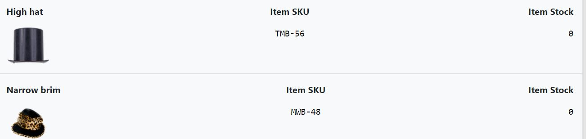

## **TESTING**

### Table of contents
1. [W3C Validation](#Validation)
1. [User Stories Testing](#User-Stories-Testing)
1. [Responsive Design Test](#Site-Responsive-design-test)
1. [CRUD Test](#CRUD)
1. [Testing Forms and validation](Testing-Forms-and-validation)
1. [Future Testing](#Future-Testing)
1. [Bugs](#Bugs)
1. [Solved issues or bugs](#Solved-issues-or-bugs)
1. [Back to Readme.md](../README.md)

### **Validation**
  The W3C Markup Validator and W3C CSS Validator Services were used to validate every page of the project to ensure there were no syntax errors in the project.

- W3C Markup Validator
  - [Index Page](../project_files/validation/index.PNG)

- W3C CSS Validation
- PEP8 requirements
- Jshint


# [&#8686;](#Testing)
[Back to Readme.md](../README.md)
## ***UX*** 
### **User Stories Testing**

### **As A Unregistered user**
✓ First time visitor is able to understand purpose of the website.\
✓ User is able to easly navigate the website.\
✓ User is able to find products by description and product name.\
✓ Good product description and Product photography.\
✓ To be able make easy and secure payments as a guest user.\
✓ To be able to contact the company for any query or issue.

### **As A Registered user**
✓ All of the above and.\
✓ Saving shipping information for fast checkout.\
✓ Access to complete overview of existing orders.\
✓ Self-manage of account details and shipping adresses for fast checkout.\
✓ Access to order history and other documents.

### **As an Administrator**
✓ Administrator monitor shop items with ease.\
✓ Administrator add/edit and delete items.\
✓ Administrator track all the purchases.\
✓ Administrator manage all the shipping information.\
✓ Administrator manage User access and accounts.

### **Site Owner goals**
✓ Get the business online and expand online presence.\
✓ Website Provide guest checkout option.\
✓ Save user deteails for fast checkout.\
✓ Offer range of Special Offers and deals.\
✓ Fast and secure payment option integrated stripe payment proccessing.\
✓ Customer Support service and product reviews.


# [&#8686;](#Testing)
[Back to Readme.md](../README.md)

### Site Responsive design test
The Website is fully responsive and will cover most of the devices (screen sizes) and resolutions with minimum width of 330px.

Below i have attached testing gif video for each page tested.
- Index Page [GIF]()


# [&#8686;](#Testing)
[Back to Readme.md](../README.md)

### CRUD 
(create, read, update, and delete) Test
- Create

- Read

- Update

- Delete


### Testing Forms and validation

### **Future Testing**
I have tested the app on a variety of browsers such as  Chrome, Opera, Microsoft Edge, and Firefox desktop version browsers and Huawei p30 Pro chrome and android browser.

I have used Chrome DevTools to Test a variety of devices such as Desktop, Laptop, iPhone7, iPhone 8 & iPhone X for responsive design.

Friends and family members helped point out any bugs or issues.

# [&#8686;](#Testing)
[Back to Readme.md](../README.md)
### **Bugs**

# [&#8686;](#Testing)
[Back to Readme.md](../README.md)
### **Solved issues or bugs**
- 

  ```javascript
      // To avoid javascript error I have 
      // added if check for current url.
      // Function Only available on shop page
      path = window.location.pathname
      if (path === '/shop/') {
 

- Sorting by rating returns Null values before rated items
  I found solutin [here Stack overflow link](https://stackoverflow.com/questions/7749216/django-order-by-date-but-have-none-at-end)
  ```python
  # Solved by adding Quary string bellow
  products.order_by(F('rating').asc(nulls_last=True))


- If cart is empty return user back to previose page but, if previose page was cart then raised key error.
  ```python
  # To solve this i have used return two addresses for each scenario 
  # if previos url was cart redirect to shopping else return previos url.
      cart = request.session.get('cart', {})
      url_back = HttpResponseRedirect(request.META.get('HTTP_REFERER'))
      if url_back != None:
          return HttpResponseRedirect(request.META.get('HTTP_REFERER'))
      else:
          return redirect(reverse('shop'))


- Cart issue.. after removeing cart items and if using back button going back to the cart, and trying to remove alredy deleted item again rised key error.
  ```python
  # To solve this issue.. I have added check function to check on POST if the item is cart session.
  # If item in sot in the session items simply return to the user message.
    if request.POST and cart:
 
 - Tables cell misalignment.

  

  ```html
  <!--  simpe solution to add bootstrap col-4 class for each column. -->
  <th class="col-4">{{ item.sku }}</th>
  ```

# [&#8686;](#Testing)
[Back to Readme.md](../README.md)